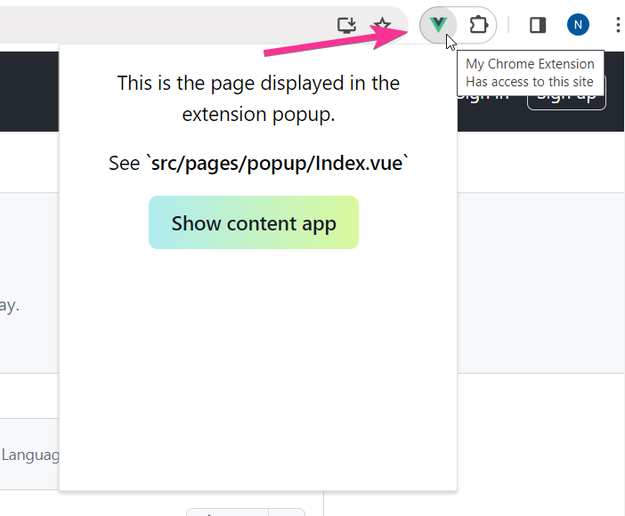
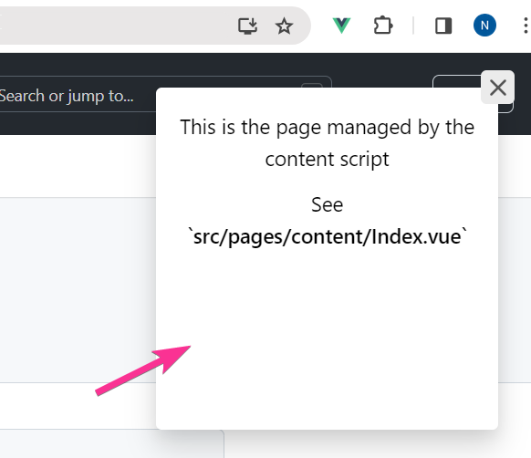

# Chrome Extension Template (Vue 3 + Vue Router + Typescript + Vite + TailwindCSS + Flowbite)

This is a template for creating a Chrome extension using Vue. It is heavily inspired by [ennjoy/chrome-extension-vuejs](https://github.com/ennjoy/chrome-extension-vuejs) but has some additional features.

# Features

### Automatic routing

The [vite-plugin-pages](https://github.com/hannoeru/vite-plugin-pages) package will generate routes for the [Vue Router](https://router.vuejs.org/) automatically based on the content of the `/pages` directory. To add a new page to the application, just create a new `.vue` file in the `/pages` directory.

### Layouts

The [vite-plugin-vue-layouts](https://github.com/johncampionjr/vite-plugin-vue-layouts) package enables you to define layouts for your application's pages, which is convenient for applications with a large number of pages.

By default, the extension popup page uses the `Popup` layout from `/src/layouts/Popup.vue` and the on-page content uses the `Content` layout from `/src/layouts/Content.vue`.

To define a layout for a page, add a `meta.layout` property to the page's route definition. See an example in `/src/pages/popup/index.vue`:

```HTML
<route lang="json5">
{
    name: 'Popup Index',
    meta: {
        layout: 'Popup'
    }
}
</route>
```

### TailwindCSS + Flowbite

[Flowbite](https://flowbite.com/) is a component library built on top of [TailwindCSS](https://tailwindcss.com/). It provides a set of ready-to-use components that you can use in your application.

I have been using Flowbite for a while and have found it to be a great tool for building UIs quickly. What I like the most is that the Flowbite's components are just plain HTML elements with TailwindCSS classes that make them look good. This makes it very easy to customize the components.

Example of a button from Flowbite:

```HTML
<button 
    type="button"
    class="text-white bg-gradient-to-br 
        from-pink-500 to-orange-400 hover:bg-gradient-to-bl 
        focus:ring-4 focus:outline-none focus:ring-pink-200 
        dark:focus:ring-pink-800 font-medium rounded-lg text-sm 
        px-5 py-2.5 text-center me-2 mb-2">
    Click Me
</button>
```

### Two entry points of the Vue application

Many Chrome extensions feature both a popup and on-page functionality. The popup typically opens when you click the extension icon in the browser toolbar, while on-page content may include elements like frames, tooltips, or floating boxes that appear directly on the web page you're viewing.

This template provides two entry points for the Vue application:

- `/src/popup/popup-main.ts` &mdash; the popup entry point
- `/src/content/content-main.ts` &mdash; the on-page content entry point

Once the application is built, the popup entry point (`popup.html`) is loaded when you click the extension icon in the browser toolbar.

<p align="center">
    
</p>

And the on-page content (`content.html`) is injected into a web page and is displayed as a floating box.

<p align="center">
    
</p>

Note: any application page from the `/pages` directory is accessible from both entry points. So it's up to you to decide which pages are accessible from the popup and which are accessible from the on-page content.

# Directory Structure

- `/_locales` &mdash; localization files for the extension
- `/helper-scripts`
  - `create-extension-build.js` &mdash; a script that creates the `extension-build` directory with the final extension build
- `/public`
  - `/icons` &mdash; extension icons
  - `/js` &mdash; helper scripts
    - `extension-worker.js` &mdash; background script for the extension (service worker)
    - `content-app.js` &mdash; the script that will inject Vue app (`content.html`) into the page.
- `/src` &mdash; Vue application

Note: the `public` directory is the part of the Vue application but it also has files that don't belong to the Vue application, for example  `extension-worker.js` and `content-app.js`. Due to the Vue build process, everything in the `public` directory will be available in the extension root directory. There is no big idea behind this, just something that I found convenient.

# How to Use

### Setup

1. Download the contents of this repository to your local machine.
2. Run `npm install` to download the required packages.
3. Run `npm run build` to create the extension build. It will be located in the `/extension-build` directory.
4. Load the extension into Chrome. Go to the [chrome://extensions](chrome://extensions) page and enable developer mode. Click `Load unpacked` button and select the `/extension-build` folder.

### Development

To work on the Vue app, run `npm run dev`. This will start the development server at localhost:5173. 

Important: [localhost:5173](http://localhost:5173) index page will not work. Use these URLs instead:

- [localhost:5173/popup.html](http://localhost:5173/popup.html) &mdash; extension popup
- [localhost:5173/content.html](http://localhost:5173/content.html) &mdash; extension on-page content

This template does not provide HMR (Hot Module Replacement) for the extension. So if you make changes to the extension's code and want to test that in the browser, you will need to re-build the extension (`npm run build`) and reload the extension on the [chrome://extensions](chrome://extensions) page.
